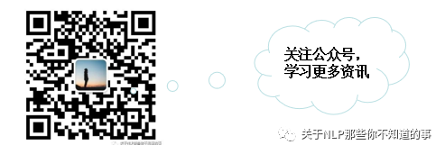
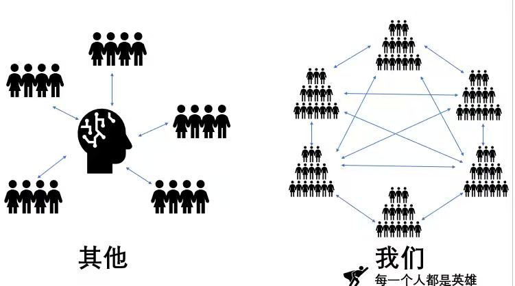

# TopicShare 开源学习论坛

> 组织成员：杨夕、Naomi、净信、糖醋鱼、HK、along等小伙伴们 
> [Topic 发起表](https://shimo.im/sheets/y98CHkv6KHvkwrQ3/MODOC) 
> **学习口号：以区块链模式推广学习** 

## 一、动机

1. 你是否也再一个人干巴巴的学习么?
2. 你是否在学习过程中，特别想找人分享自己的见解？
3. 你是否也特别希望有一群小伙伴可以和你一起讨论学习？

那么，加入我们，将使你解决以上烦恼！！！

1. 发起人 先 确定好 Topic 和 预分享的时间；
2. 负责人会 提前两周 做一次宣传，帮 发起人 找 参与者，然后建群；
3. 发起人 和 参与者 可以一起分工，对该 Topic 进行调研和设计；
4. 发起人 觉得 准备 OK 之后，由负责人帮忙定一个时间 组织群内分享；

## 二、 TopicShare 存在价值

TopicShare 想做的事：
1. 选取比较成熟的 Topic 和 做一些 开源方案 分享；
2. 给 TopicShare 成员一个一起学习一起讨论的空间，以帮助组织成员更好**“高效+全面”**学习；
3. 认识更多更优秀的小伙伴！

## 三、TopicShare 的学习模式及口号

### 3.1 TopicShare 基本信息

- **活动通知公众号**

- **分享方式：腾讯会议**
- **Topic 分享：每周六 晚上 20:30**

### 3.2  **学习模式**

1. 发起人 先 确定好 **[Topic 发起表](https://shimo.im/sheets/y98CHkv6KHvkwrQ3/MODOC) **和 预分享的时间；
2. TopicShare组织者 会提前两周 做一次宣传，帮 发起人 找 参与者，然后建群；
3. 发起人 和 参与者 可以一起分工，对该 Topic 进行调研和设计；
4. 发起人 觉得 准备 OK 之后，由 TopicShare组织者 帮忙定一个时间 在学习群内分享 腾讯会议 会议 ID；
5. Topic 分享开始时，TopicShare组织者 会 组织 发起人 分享，并在 学习群内，通知学员参与旁听；

### 3.3 **学习口号：以区块链模式推广学习**

### 3.4 **目前已沉淀的 开源方案**

1. [nlp_paper_study](https://github.com/km1994/nlp_paper_study) 

该项目主要是本人在研读顶会论文和复现经典论文过程中，所见、所思、所想、所闻。

2. [NLP 百面百搭](https://github.com/km1994/NLP-Interview-Notes) 

本项目是作者们根据个人面试和经验总结出的自然语言处理(NLP)面试准备的学习笔记与资料，该资料目前包含 自然语言处理各领域的 面试题积累。

3. [知识图谱构建 DeepKg](https://github.com/powerycy/DeepKg) 

本项目致力于知识图谱的构建，目前正一点一点搭建其方法，也希望能帮助更多的人，

4. [RS_paper_study](https://github.com/km1994/RS_paper_study) 

该项目主要是本人在研读顶会论文和复现经典论文过程中，所见、所思、所想、所闻。

5. [NLP 项目 的 tensorflow 实现](https://github.com/km1994/bert_to_nlp_tf) 

该项目主要 使用 tensorflow 框架 复现 NLP 基础任务上的应用。

6. [Leetcode 刷题手册](https://github.com/km1994/leetcode) 

因为目前正在 找工作需要刷题，为了方便后期学习，我将自己刷过的 题目以及对应的解法记录 于该项目中，方便后期学习，也方便大家学习。

## 四、如何旁听 Topic 分享？如何加入我们？

- **如何旁听 Topic 分享？**

我会建立一个 TopicShare 旁听群，然后 每一个 想听分享的成员会先加入该群，然后 每周末我们会在 该群里面 发 Topic 飞书分享链接。

> TopicShare 旁听群

- **如何加入我们？**

在 ** [Topic 发起表](https://shimo.im/sheets/y98CHkv6KHvkwrQ3/MODOC) ** 上面 填写 想分享的 Topic，然后 添加 TopicShare 组织者 微信号 blqkm601，注明参与分享即可。

## 五、 TopicShare 分享顺序

每个人选择自己感兴趣的 Topic，确定每一个 Topic 的分享时间，每一个组织成员需要记住分享时间，避免忘记分享；（**PS：如果觉得自己因为工作或者其他原因没时间，那么我觉得没必要参与进来，因为这种方式对于你来说进步并不大，而且还会浪费过多的时间和精力**）

## 六、TopicShare 管理机制

为方便审核组的管理，我们将成立审核组，审核组工作：

1. 负责 新成员 的加入 考核；
2. 负责 TopicShare 学习群 的 通知 和 管理；
3. 负责 TopicShare 学习群 的优化工作；

## 七、TopicShare 构思

梯度 方式（建立 一个 分享群，所有人都可以加入，每周定期有人分享，比较优秀的人可以加入 TopicShare 学习群）

## 八、TopicShare 必须分享内容

1. 领域知识介绍(10-20 min)；
2. 常用方法，思路；
3. 预处理代码、模型代码；
4. 业界方法 和 学术界方法 调研；
5. 个人观点；

## 九、TopicShare 分享 Topic 管理

### Topic 7

#### Topic 7 >> 自然语言处理

1. [Named Entity Recognition as Dependency Parsing](https://github.com/km1994/TopicShareShare/tree/master/Topic7/nlp/biaffier/biaffier.pdf)【杨夕】【[论文](https://github.com/km1994/TopicShareShare/tree/master/Topic7/nlp/biaffier/2020.acl-main.577.pdf)】
2. [SimCSE](https://github.com/km1994/TopicShareShare/tree/master/Topic7/nlp/biaffier/SimCSE.pdf)【Lver】【[论文](https://github.com/km1994/TopicShareShare/tree/master/Topic7/nlp/biaffier/2104.08821.pdf)】
3. [盘点近年来的命名实体识别](https://zhuanlan.zhihu.com/p/375805722)【Ycy】

#### Topic 7 >> 推荐系统

### Topic 6

#### Topic 6 >> 自然语言处理

1. [A User-Centered Concept Mining System for Query and Document Understanding at Tencent](https://github.com/km1994/TopicShareShare/tree/master/Topic6/NLP/ELECTRA.pptx)【Sm1les】
2. [Attention is All you need](https://github.com/km1994/TopicShareShare/tree/master/Topic6/NLP/transformer/post.pdf)【[paper](https://github.com/km1994/TopicShareShare/tree/master/Topic6/NLP/transformer/paper.pdf)】【丽萍】
3. [Document-Level RE with Adaptive Thresholding and Localized Context Pooling](https://github.com/km1994/TopicShareShare/tree/master/Topic6/NLP/docrel/post.pdf)【[paper](https://github.com/km1994/TopicShareShare/tree/master/Topic6/NLP/docrel/paper.pdf)】【海顺】

#### Topic 6 >> 图像处理

#### Topic 6 >> 推荐系统

1. [DeepCF A Unified Framework of Representation Learning and Matching Function Learning in Recommender System](https://github.com/km1994/TopicShareShare/tree/master/Topic6/RES/Faiss.pdf)【Jespon】

### Topic 5

#### Topic 5 >> 自然语言处理

1. [A User-Centered Concept Mining System for Query and Document Understanding at Tencent](https://github.com/km1994/TopicShareShare/tree/master/Topic5/NLP/concept.pdf)【Sm1les】
2. [Multi-Source Domain Adaptation with Mixture of Experts](https://github.com/km1994/TopicShareShare/tree/master/Topic5/NLP/MOE.pdf)
3. [XLNet: Generalized Autoregressive Pretraining for Language Understanding](https://github.com/km1994/TopicShareShare/tree/master/Topic5/NLP/XLNet.pdf)【玲玲】【[视频分享](https://pan.baidu.com/s/1DZemw2uvQEUGNnFy5XBqWw) 提取码：g1ky 】
4. [模型蒸馏](https://github.com/km1994/TopicShareShare/tree/master/Topic5/NLP/模型蒸馏/模型蒸馏.pdf)【李威】【[视频分享](https://pan.baidu.com/s/1kT051jAqVHESAsaKzGL19w) runl 】
   1. [DistilBERT](https://github.com/km1994/TopicShareShare/tree/master/Topic5/NLP/模型蒸馏/DistilBERT.pdf)
   2. [FastBERT](https://github.com/km1994/TopicShareShare/tree/master/Topic5/NLP/模型蒸馏/FastBERT.pdf)
   3. [TinyBert](https://github.com/km1994/TopicShareShare/tree/master/Topic5/NLP/模型蒸馏/TinyBert.pdf)
5. [Neural Snowball for Few-Shot Relation Learning](https://github.com/km1994/TopicShareShare/tree/master/Topic5/NLP/FewShotRelationLearning.pdf)【王翔】【[视频分享](https://pan.baidu.com/s/1LSz_ky2i_1qPBd0xHCgqoA ) yaoa 】
6. [Rethinking Self-Attention in Transformer Models](https://github.com/km1994/TopicShareShare/tree/master/Topic5/NLP/RethinkingSelfAttention/注意力思考_20201031231713.pdf)【大好人】
7. [TextCNN](https://github.com/km1994/TopicShareShare/tree/master/Topic5/NLP/RethinkingSelfAttention/textCNN.pdf)【以若】
8. [Double Graph Based Reasoning for Document-level Relation Extraction (EMNLP 2020)](https://github.com/km1994/TopicShareShare/tree/master/Topic5/NLP/RethinkingSelfAttention/dw_chs.pdf)【陈海顺】
9. [Event Extraction via Dynamic Multi-Pooling Convolutional Neural Networks](https://github.com/km1994/TopicShareShare/tree/master/Topic5/NLP/DMCNN_20201215221301.pdf)【周郴莲】
10. [知识图谱构建](https://github.com/km1994/TopicShareShare/tree/master/Topic5/NLP/知识图谱构建.pdf)【王翔】

#### Topic 5 >> 图像处理

1. [EAST学习笔记](https://github.com/km1994/TopicShareShare/tree/master/Topic5/CV/EAST学习笔记/EAST学习笔记.pdf)【安晟】
2. [CNN可解释性](https://github.com/km1994/TopicShareShare/tree/master/Topic5/CV/ABN.pdf)【李国樑】【视频有需要找负责人拿，谢谢】
3. [FOTS: Fast Oriented Text Spotting with a Unified Network](https://github.com/km1994/TopicShareShare/tree/master/Topic5/CV/FOST.pdf)【苏静静】
4. [Interpretable CNN](https://github.com/km1994/TopicShareShare/tree/master/Topic5/CV/InterpretableCNN.pdf)【李文涛】
5. [YOLOv5](https://github.com/km1994/TopicShareShare/tree/master/Topic5/CV/YOLOv5.pdf)【王立杰】
6. [Progressive Feature Alignment for Unsupervised Domain Adaptation](https://github.com/km1994/TopicShareShare/tree/master/Topic5/CV/Progressive_feature_alignment.pdf)【苏丽敏】

#### Topic 5 >> 推荐系统

1. [DeepCF A Unified Framework of Representation Learning and Matching Function Learning in Recommender System](https://github.com/km1994/TopicShareShare/tree/master/Topic5/RES/deepcf_20201010224648.pdf)【Jespon】
2. [EMBEDDING-BASED RETRIEVAL IN FACEBOOK SEARCH](https://github.com/km1994/TopicShareShare/tree/master/Topic5/RES/EBR_20201010224722.pdf)【星】
3. [FiBiNET: Combining Feature Importance and Bilinear feature Interaction for Click- Through Rate Prediction](https://github.com/km1994/TopicShareShare/tree/master/Topic5/RES/FiBiNet分享.pdf)【Stefan】
4. [Deep_Match_to_Rank_Model_for_Personalized_Click](https://github.com/km1994/TopicShareShare/tree/master/Topic5/RES/Deep_Match_to_Rank_Model_for_Personalized_Click.pdf)【阿泽】【[视频分享](https://pan.baidu.com/s/1DFqZMBxeqiZJuepDQHIDyA) 提取码：gxdc 】
5. [Local Item-Item Models for Top-N Recommendation 笔记](https://github.com/km1994/TopicShareShare/tree/master/Topic5/RES/GLSLIM/GLSLIM_笔记.pdf)【白玉瑶】【[视频分享](https://pan.baidu.com/s/1-EW0dVzcHO2_rA5j3mteOg) 提取码：o0wt 】
   1. [Local Item-Item Models for Top-N Recommendation 论文](https://github.com/km1994/TopicShareShare/tree/master/Topic5/RES/GLSLIM/GLSLIM.pdf)
6. [Knowledge Enhanced Personalized Search 笔记](https://github.com/km1994/TopicShareShare/tree/master/Topic5/RES/KnowledgeEnhancedPersonalizedSearch/KEPS.pdf)【宋志伟】
   1. [Knowledge Enhanced Personalized Search 论文](https://github.com/km1994/TopicShareShare/tree/master/Topic5/RES/KnowledgeEnhancedPersonalizedSearch/KnowledgeEnhancedPersonalizedSearch.pdf)
7. [基于元矩阵分解的联邦评分预测任务](https://github.com/km1994/TopicShareShare/tree/master/Topic5/RES/MetaMF/MetaMF-TopicShare-20201213.pdf) 【Honglei Zhang】
8. [ATBRG: Adaptive Target-Behavior Relational Graph Network for Effective Recommendation](https://github.com/km1994/TopicShareShare/tree/master/Topic5/RES/MetaMF/ATBRG_20201220213931.pdf) 【田雨】

### Topic 4

#### Topic 4 >> 自然语言处理

1. [Fine-tune BERT for Extractive Summarization](https://shimo.im/docs/3cpY66PhYydPpxPh#anchor-Hkcy)【杨夕】
2. [句子重排序论文串讲](https://shimo.im/docs/3cpY66PhYydPpxPh#anchor-GNkw)【张帆】
3. [seqGAN 文本生成](https://shimo.im/docs/3cpY66PhYydPpxPh#anchor-21M2)【李文乐】
4. [命名实体识别 之 Dynamic Architecture](https://github.com/km1994/nlp_paper_study/tree/master/NER_study/DynamicArchitecture)【杨夕】
   1. [Chinese NER Using Lattice LSTM（ACL2018）](https://github.com/km1994/nlp_paper_study/tree/master/NER_study/DynamicArchitecture/1_ACL2018_LatticeLSTM)
   2. [LR-CNN: CNN-Based Chinese NER with Lexicon Rethinking(IJCAI2019)](https://github.com/km1994/nlp_paper_study/tree/master/NER_study/DynamicArchitecture/2_IJCAI2019_LR_CNN)
   3. [CGN: Leverage Lexical Knowledge for Chinese Named Entity Recognition via Collaborative Graph Network（EMNLP2019）](https://github.com/km1994/nlp_paper_study/tree/master/NER_study/DynamicArchitecture/3_EMNLP2019_CGN)
   4. [LGN: A Lexicon-Based Graph Neural Network for Chinese NER(EMNLP2019)](https://github.com/km1994/nlp_paper_study/tree/master/NER_study/DynamicArchitecture/4_EMNLP2019_LGN)
   5. [FLAT: Chinese NER Using Flat-Lattice Transformer](https://github.com/km1994/nlp_paper_study/tree/master/NER_study/DynamicArchitecture/5_ACL2020_FLAT)
5. [Attention Is All You Need]()
   1. [Transformer理论源码细节详解](https://zhuanlan.zhihu.com/p/106867810)【我是大好人】
   2. [【关于Transformer】 那些的你不知道的事](https://github.com/km1994/nlp_paper_study/tree/master/transformer_study/Transformer)【杨夕】

#### Topic 4 >> 图像处理

1. [Deep Face Recognition: A Survey](https://shimo.im/docs/p3dqHGXRxwrDtpRw#anchor-KppZ)【安晟】
2. [人脸识别损失函数](https://shimo.im/docs/p3dqHGXRxwrDtpRw#anchor-Kgue)【蘇靜】
3. [MTCNN](https://shimo.im/docs/p3dqHGXRxwrDtpRw#anchor-92e8)【】
4. [YOLO](https://shimo.im/docs/p3dqHGXRxwrDtpRw#anchor-yYYw)【张文涛】
5. [YOLO v2](https://shimo.im/docs/p3dqHGXRxwrDtpRw#anchor-d1Ga)【张文涛】
6. [Circle Loss](https://shimo.im/docs/p3dqHGXRxwrDtpRw#anchor-dr8c)【CJ】
7. [SPP-Net](https://shimo.im/docs/p3dqHGXRxwrDtpRw#anchor-fjRs)【李国梁】
8. [YOLO_V4](https://github.com/km1994/TopicShareShare/tree/master/Topic4/CV/YOLO_V4.pdf)【以若】

#### Topic 4 >> 推荐系统

1. [Entire Space Multi-Task Model: An Effective Approach for Estimating Post-Click Conversion Rate](https://github.com/km1994/TopicShareShare/tree/master/Topic5/RES/ESMM分享.pdf)【Stefan】

### Topic 3

#### Topic 3 >> 自然语言处理

1. 【[【关于 实体关系联合抽取】 那些你不知道的事](https://github.com/km1994/TopicShareShare/tree/master/Topic3/NLP/)】
2. [GraphRel:Modeling Text as Relational Graphs for Joint Entity and Relation Extraction [ACL2019]](https://shimo.im/docs/KKHw8DDvkTYYvxq9#anchor-bb5z)【杨夕】
3. [A Novel Cascade Binary Tagging Framework for Relational Triple Extraction [ACL2020]](https://shimo.im/docs/KKHw8DDvkTYYvxq9#anchor-jyQn)【我是大好人】
4. [CopyMTL: Copy Mechanism for Joint Extraction of Entities and Relations with Multi-Task Learning [AAAI2020]](https://shimo.im/docs/KKHw8DDvkTYYvxq9#anchor-Hq1F)【李方】
5. [Span-based Joint Entity and Relation Extraction with Transformer Pre-training [ECAI 2020]](https://shimo.im/docs/KKHw8DDvkTYYvxq9#anchor-fFxn)
6. [Joint Extraction of Entities and Relations Based on a Novel Decomposition Strategy](https://shimo.im/docs/KKHw8DDvkTYYvxq9#anchor-Pr97)
7. [Joint entity recognition and relation extraction as a multi-head selection problem](https://shimo.im/docs/KKHw8DDvkTYYvxq9#anchor-sbDK)

#### Topic 3 >> 图像处理

1. [医学图像分割总结](https://shimo.im/docs/6Q6CwhxwT63r3C8d#anchor-ABpp)
2. [U-Net: Convolutional Networks for Biomedical Image Segmentation](https://shimo.im/docs/6Q6CwhxwT63r3C8d#anchor-bb5z)
3. [Cell R-CNN V3: A Novel Panoptic Paradigm for Instance Segmentation in Biomedical Images](https://shimo.im/docs/6Q6CwhxwT63r3C8d#anchor-rLIa)【蘇靜】
4. [CS-Net: Channel and Spatial Attention Network for Curvilinear Structure Segmentation](https://shimo.im/docs/6Q6CwhxwT63r3C8d#anchor-6p8J)【蘇靜】
5. [Capsule network for biomedical image segmentation](https://shimo.im/docs/6Q6CwhxwT63r3C8d#anchor-Bgtu)【张强】

### Topic 2

#### Topic 2 >> 自然语言处理 之 基于细粒度情感分析

1. [LCF: A Local Context Focus Mechanism for Aspect-Based Sentiment
Classification](https://github.com/km1994/TopicShareShare/tree/master/Topic2/NLP/4-LCF.pdf)【杨夕】

### Topic 1

#### Topic 1 >> 自然语言处理 之 文本匹配

1. [Lattice CNNs for Matching Based Chinese Question Answering](https://github.com/km1994/TopicShareShare/tree/master/Topic1/NLP/3-LCNQA.pdf)【杨夕】
2. [自然语言处理（Natural Language Processing，NLP）](https://github.com/km1994/TopicShareShare/tree/master/Topic1/NLP/NLP介绍.pdf)【杨夕】
3. [Multi-Perspective Sentence Similarity Modeling with Convolutional Neural Networks](https://github.com/km1994/TopicShareShare/tree/master/Topic1/NLP/MPCNN.pdf)【黑桃】
4. [Simple and Effective Text Matching with Richer Alignment Features](https://github.com/km1994/TopicShareShare/tree/master/Topic1/NLP/深度学习分享之文本匹配.pdf)【李文乐】

#### Topic 1 >> 图像处理 之 人脸识别

1. [Dual attention network for Scene Segmentation](https://github.com/km1994/TopicShareShare/tree/master/Topic1/CV/DANet.pdf)【杨夕】
2. [EfficientNet : Rethinking Model Scaling for Convolutional Neural Networks](https://github.com/km1994/TopicShareShare/tree/master/Topic1/CV/efficientnet.pdf)【蘇靜】
3. [Accelerating Proposal Generation Network for Fast Face Detection on Mobile Devices](https://github.com/km1994/TopicShareShare/tree/master/Topic1/CV/faceDetection.pdf)【以若】

### 初期

#### 初期 >> 自然语言处理

1. [Attention is all you need](https://github.com/km1994/TopicShareShare/tree/master/old/NLP/attention_is_all_you_need.pdf)【李方】
2. [关系抽取 综述](https://github.com/km1994/TopicShareShare/tree/master/old/NLP/关系抽取review.pdf)【杨夕】
3. [命名实体识别 综述](https://github.com/km1994/TopicShareShare/tree/master/old/NLP/命名实体识别review.pdf)【杨夕】
4. [Multi-grained Attention Network for AspectLevel Sentiment Classification](https://github.com/km1994/TopicShareShare/tree/master/old/NLP/ABSA.pdf)【李文乐】
5. [Transformer及其变体](https://github.com/km1994/TopicShareShare/tree/master/old/NLP/Transformer及其变体.pdf)【Jepson】

#### 初期 >> 图像处理

1. [RetinaFace: Single-stage Dense Face Localisation in the Wild](https://github.com/km1994/TopicShareShare/tree/master/old/CV/RetinaFace.pdf)【蘇靜】

## 待续。。。

## 参考

1. [Topic 发起表](https://shimo.im/sheets/y98CHkv6KHvkwrQ3/MODOC)
2. [nlp_paper_study](https://github.com/km1994/nlp_paper_study) 
3. [NLP 百面百搭](https://github.com/km1994/NLP-Interview-Notes) 
4. [知识图谱构建 DeepKg](https://github.com/powerycy/DeepKg) 
5. [RS_paper_study](https://github.com/km1994/RS_paper_study) 
6. [NLP 项目 的 tensorflow 实现](https://github.com/km1994/bert_to_nlp_tf) 
7. [Leetcode 刷题手册](https://github.com/km1994/leetcode) 
