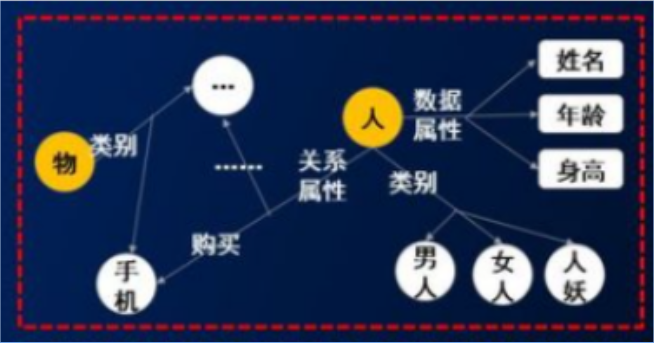
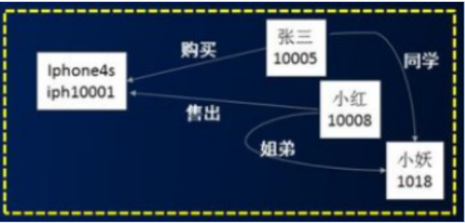

# 【关于 知识图谱】 那些你不知道的事

## 一、什么是知识图谱？

### 1.1 知识图谱本质

一种语义网络，将客观事实和经验沉淀在一个巨大的网络中。

### 1.2 知识图谱包含内容

- 实体（entity）
- 概念（concepts）
- 语义关系（semantic relationships）
- 属性（attributes）

### 1.3 何为 本体？何为实例？

- 本体

- 实例

## 参考

1. [知识图谱](https://shimo.im/mindmaps/Vhk3VwQHxG9dQYV3)

