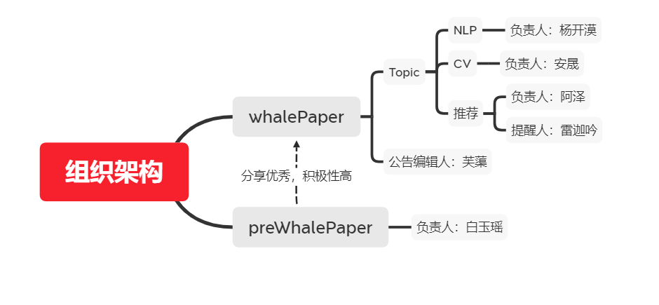

<!-- slide -->

# paperShale 介绍

> 组织成员：杨夕、Jepson、王翔等小伙伴们 

<!-- slide -->

## 动机

1. 你是否也再一个人干巴巴的读论文?
2. 你是否在看论文过程中，特别想找人分享自己的见解？
3. 你是否也特别希望有一群小伙伴可以和你一起讨论学习？

那么，加入我们，将使你解决以上烦恼！！！

<!-- slide -->

##  存在价值

1. 选取比较成熟的 Topic 和 做一些 开源方案 分享；
2. 给 whalePaper 成员一个一起看论文一起讨论的空间，以帮助组织成员更好“高效+全面”学习；
3. 认识更多更优秀的小伙伴！

<!-- slide -->

## 分享模式

- 模式：按周期分享【一个周期为所有人分享一次】；
- 分享情况：每个Topic一周一个人分享
- 流程：
  - 填报阶段：填报自己感兴趣的论文；
  - 确定时间阶段：确定每个人的分享时间；
  - 分享阶段：每个人需要准备好 ppt 进行分享；

<!-- slide -->

## 每周分享时间

- NLP 论文分享：每周六 晚上 九点半
- 推荐系统 论文分享：每周日晚上八点半

<!-- slide -->

## 组织架构

<!-- slide -->

## 论文填报

- 论文填报：https://shimo.im/sheets/xNOGNvdFEj0AN81U/oK897
- whalePaper 资源分享：https://github.com/km1994/whalePaperShare
<!-- slide -->